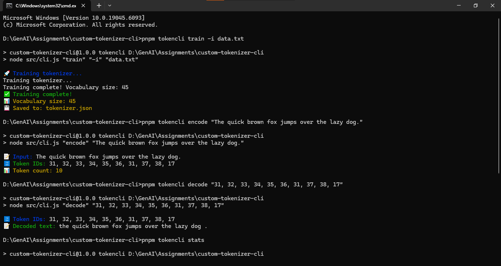

# Custom Tokenizer CLI

A command-line interface (CLI) for training, encoding, decoding, and analyzing custom tokenizers.

## Installation

1. Clone the repository or download the source code.
2. Install dependencies using `pnpm` (or `npm`):

   ```bash
   pnpm install
   ```

## Usage

Run the CLI using the following command:

```bash
npm run tokencli <command> [options]
```

## Commands

### 1. Train
Train a tokenizer on a text file.

```bash
npm run tokencli train -i <input-file> -o <output-file> -m <min-frequency>
```

**Options:**
- `-i, --input <file>`: Input text file (default: sample text).
- `-o, --output <file>`: Output tokenizer file (default: `tokenizer.json`).
- `-m, --min-freq <number>`: Minimum token frequency (default: `1`).

**Example:**
```bash
npm run tokencli train -i data.txt -o tokenizer.json -m 2
```

### 2. Encode
Encode text into token IDs.

```bash
npm run tokencli encode -t <tokenizer-file> -s <text>
```

**Options:**
- `-t, --tokenizer <file>`: Tokenizer file (default: `tokenizer.json`).
- `-s, --special`: Add special tokens.

**Example:**
```bash
npm run tokencli encode -t tokenizer.json -s "Hello, world!"
```

### 3. Decode
Decode token IDs back into text.

```bash
npm run tokencli decode -t <tokenizer-file> -k <ids>
```

**Options:**
- `-t, --tokenizer <file>`: Tokenizer file (default: `tokenizer.json`).
- `-k, --keep-special`: Keep special tokens in the output.

**Example:**
```bash
npm run tokencli decode -t tokenizer.json -k "1,2,3,4"
```

### 4. Stats
Display tokenizer statistics.

```bash
npm run tokencli stats -t <tokenizer-file>
```

**Options:**
- `-t, --tokenizer <file>`: Tokenizer file (default: `tokenizer.json`).

**Example:**
```bash
npm run tokencli stats -t tokenizer.json
```

## Examples with Results

### Train, Encode, and Decode
Below is an example of the results for the `train`, `encode`, and `decode` commands:



### Stats
Here is an example of the `stats` command output:

